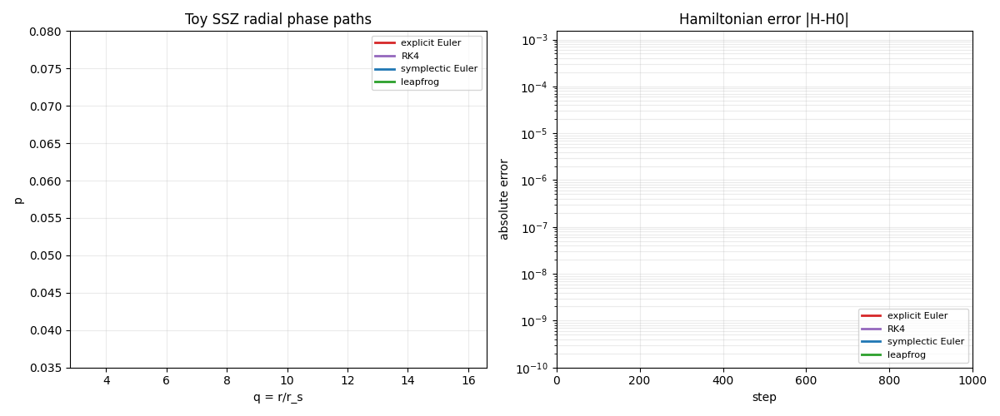

# Visualization Index

Every listed artifact is generated from repository code:

```bash
python python/run_all.py
```

Each animation is `1280 x 720`; each static fallback is `1920 x 1080`. The static PNG is a deliberately selected explanatory state, not automatically frame zero.

Meta dashboards for documentation counts, repository relationships and test status are intentionally excluded. A figure belongs here only when it explains a mathematical identity, numerical behavior, physical routing decision or claim boundary.

## Catalog

| Visual | Mathematical or physical question | What changes in the animation | Claim boundary |
|---|---|---|---|
| [Symplectic area](outputs/symplectic_area_preservation.gif) | Does a canonical rotation preserve area? | Region angle and accumulated centroid path | Controlled planar rotation only |
| [Phase-space energy](outputs/phase_space_energy.gif) | Does leapfrog keep a harmonic orbit near one energy contour? | Integrated path and energy error | Harmonic oscillator benchmark |
| [Integrator comparison](outputs/symplectic_vs_euler.gif) | How do naive and structure-preserving steps differ? | Three phase paths and error histories | Numerical method comparison only |
| [Cauchy-Riemann residual](outputs/holomorphic_curve_residual.gif) | How does anti-holomorphic contamination register numerically? | Perturbation strength and residual field | Finite-difference toy map |
| [Lagrangian intersections](outputs/lagrangian_intersections.gif) | How do intersections change under translation? | Moving curve, intersection points and count | Thresholded torus-square model |
| [Moduli degeneration](outputs/moduli_space_toy.gif) | How can a solution family pass through a singular fiber? | Parameter and current fiber | Elementary family only |
| [Knot distortion](outputs/knot_distortion.gif) | Which sampled pair maximizes intrinsic/chord ratio? | Camera angle around one finite sample | Not a knot-distortion theorem |
| [SSZ dependency chain](outputs/ssz_symplectic_bridge.gif) | How do Xi, D, V_eff and a radial phase path connect? | One numerically integrated leapfrog path | Exterior `x >= 1`, declared SSZ profile and toy Hamiltonian |
| [Phi ladder state](outputs/phi_ladder_state.gif) | How do exterior phi levels map to the local SSZ state? | Selected level `k=0..5` | Declared local-saturation profile |
| [Method assignment](outputs/method_assignment_flow.gif) | Which method belongs to each observable class? | Highlighted routing row | Routing guardrail, not a result |
| [Holonomy loop](outputs/holonomy_loop.gif) | Why does a static ratio loop cancel, and what extra assumption makes it non-trivial? | Marker on the separate dynamic toy curve | Dynamic curve is illustrative |
| [Regime map](outputs/regime_blend_map.gif) | How do physical regimes differ from formula domains? | Radius marker and active routing column | Exterior `x >= 1` and declared SSZ profile boundaries |
| [Hamiltonian drift](outputs/hamiltonian_drift_report.gif) | What does phase-path overlap hide about numerical error? | Paths, error histories and cumulative energy bands | Toy radial SSZ potential |

Static fallbacks use the same stem with `.png` instead of `.gif`.

## Mathematical Geometry

### Symplectic Area Preservation


[Static PNG](outputs/symplectic_area_preservation.png)

### Phase-Space Energy


[Static PNG](outputs/phase_space_energy.png)

### Integrator Comparison


[Static PNG](outputs/symplectic_vs_euler.png)

### Cauchy-Riemann Residual


[Static PNG](outputs/holomorphic_curve_residual.png)

### Lagrangian Intersections


[Static PNG](outputs/lagrangian_intersections.png)

### Moduli-Space Degeneration


[Static PNG](outputs/moduli_space_toy.png)

### Sampled Knot Distortion


[Static PNG](outputs/knot_distortion.png)

## SSZ Diagnostics

### Scalar-to-Hamiltonian Dependency Chain


[Static PNG](outputs/ssz_symplectic_bridge.png)

### Exterior Phi-Ladder State


[Static PNG](outputs/phi_ladder_state.png)

### Observable Method Assignment


[Static PNG](outputs/method_assignment_flow.png)

### Static and Dynamic Holonomy


[Static PNG](outputs/holonomy_loop.png)

### Physical Regime and Formula Domain


[Static PNG](outputs/regime_blend_map.png)

### Hamiltonian Drift



[Static PNG](outputs/hamiltonian_drift_report.png) | [Numeric report](docs/hamiltonian-drift-report.md)
