# Visualization Index

All visualizations are generated by:

```bash
python python/run_all.py
```

## Generated Outputs

| Animation | Static PNG | Meaning |
|---|---|---|
| `outputs/symplectic_area_preservation.gif` | `outputs/symplectic_area_preservation.png` | Hamiltonian flow preserves phase-space area. |
| `outputs/phase_space_energy.gif` | `outputs/phase_space_energy.png` | Energy contours and leapfrog orbit in phase space. |
| `outputs/symplectic_vs_euler.gif` | `outputs/symplectic_vs_euler.png` | Naive Euler drift versus symplectic methods. |
| `outputs/holomorphic_curve_residual.gif` | `outputs/holomorphic_curve_residual.png` | Cauchy-Riemann residual under non-holomorphic perturbation. |
| `outputs/lagrangian_intersections.gif` | `outputs/lagrangian_intersections.png` | Toy Lagrangian intersections on a torus square. |
| `outputs/moduli_space_toy.gif` | `outputs/moduli_space_toy.png` | Degenerating solution spaces, motivating virtual methods. |
| `outputs/knot_distortion.gif` | `outputs/knot_distortion.png` | Sampled distortion on a trefoil-like polygon. |
| `outputs/repo_interplay_map.gif` | `outputs/repo_interplay_map.png` | Methodological map across Pardon geometry and SSZ repos. |
| `outputs/ssz_symplectic_bridge.gif` | `outputs/ssz_symplectic_bridge.png` | SSZ Xi/D/effective-potential and Hamiltonian phase-space bridge. |
| `outputs/regime_blend_map.gif` | `outputs/regime_blend_map.png` | Formula domains versus physical regimes and guardrails. |
| `outputs/holonomy_loop.gif` | `outputs/holonomy_loop.png` | Closed-loop frequency-ratio/holonomy toy model. |
| `outputs/method_assignment_flow.gif` | `outputs/method_assignment_flow.png` | Prime Directive observable routing and method assignment. |
| `outputs/phi_ladder_state.gif` | `outputs/phi_ladder_state.png` | Full phi-ladder state vector details. |
| `outputs/ssz_doc_audit.gif` | `outputs/ssz_doc_audit.png` | Full SSZ documentation audit: section counts, keyword hotspots and bridge targets. |

## Embedded Gallery

### Symplectic Area Preservation

Hamiltonian flow preserves phase-space area.

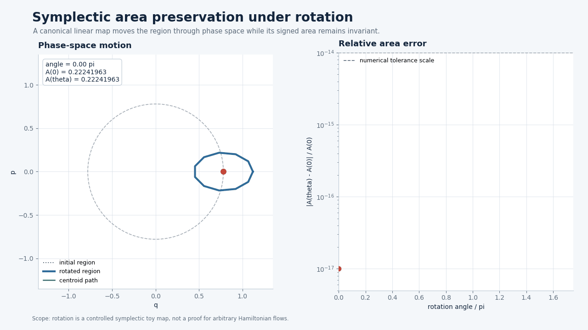

[Static PNG](outputs/symplectic_area_preservation.png)

### Phase Space Energy

Energy contours and leapfrog orbit in phase space.


[Static PNG](outputs/phase_space_energy.png)

### Symplectic Vs Euler

Naive Euler drift versus symplectic methods.

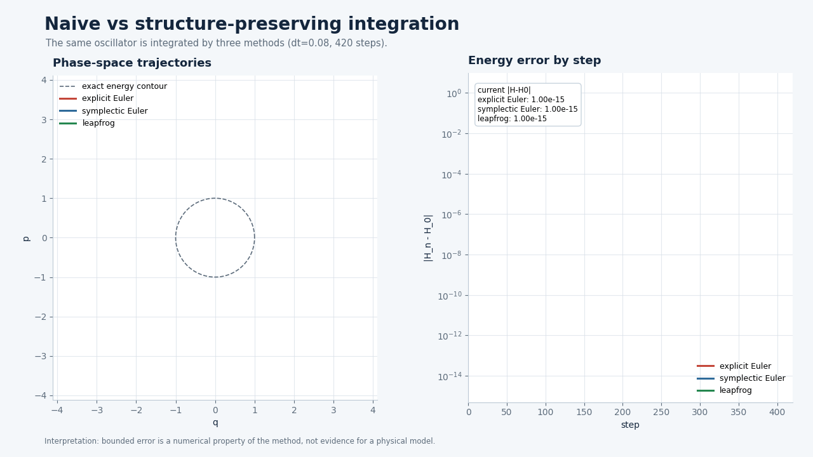

[Static PNG](outputs/symplectic_vs_euler.png)

### Holomorphic Curve Residual

Cauchy-Riemann residual under non-holomorphic perturbation.

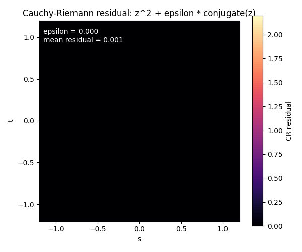

[Static PNG](outputs/holomorphic_curve_residual.png)

### Lagrangian Intersections

Toy Lagrangian intersections on a torus square.

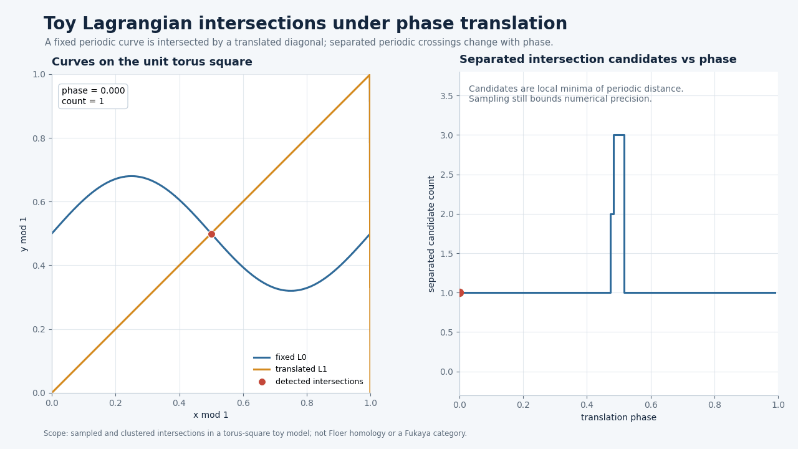

[Static PNG](outputs/lagrangian_intersections.png)

### Moduli Space Toy

Degenerating solution spaces, motivating virtual methods.

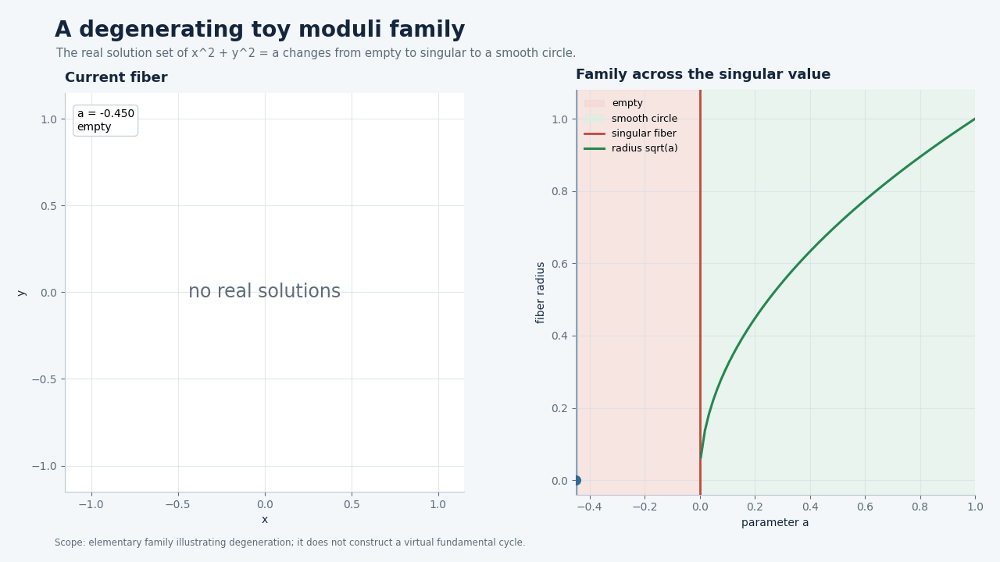

[Static PNG](outputs/moduli_space_toy.png)

### Knot Distortion

Sampled distortion on a trefoil-like polygon.

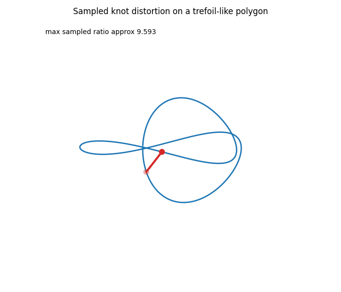

[Static PNG](outputs/knot_distortion.png)

### Repo Interplay Map

Methodological map across Pardon geometry and SSZ repos.

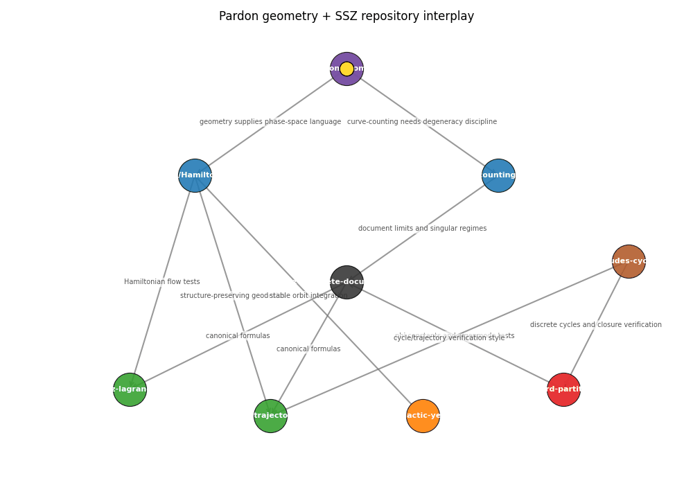

[Static PNG](outputs/repo_interplay_map.png)

### SSZ Symplectic Bridge

SSZ Xi/D/effective-potential and Hamiltonian phase-space bridge.

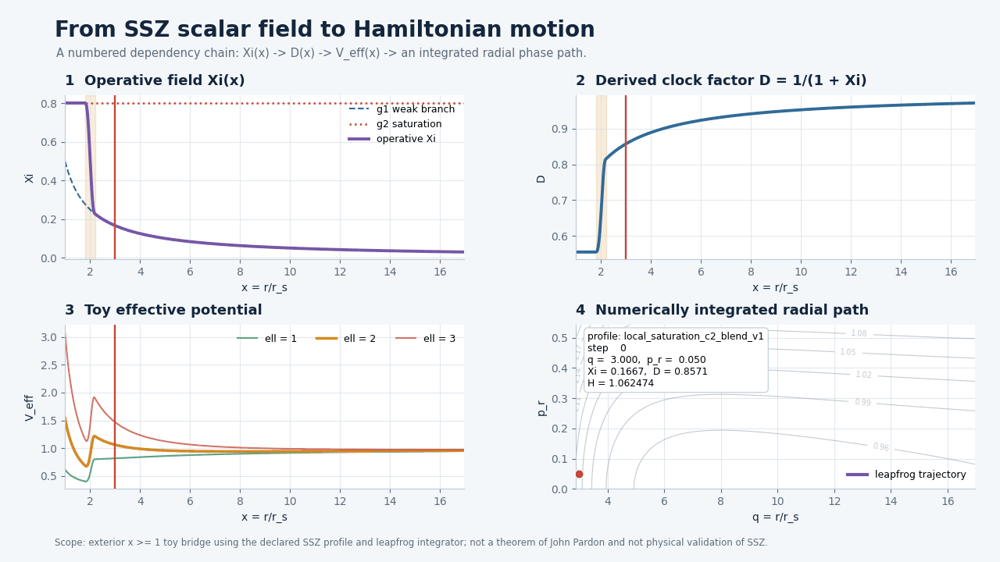

[Static PNG](outputs/ssz_symplectic_bridge.png)

### Regime Blend Map

Formula domains versus physical regimes and guardrails.


[Static PNG](outputs/regime_blend_map.png)

### Holonomy Loop

Closed-loop frequency-ratio/holonomy toy model.

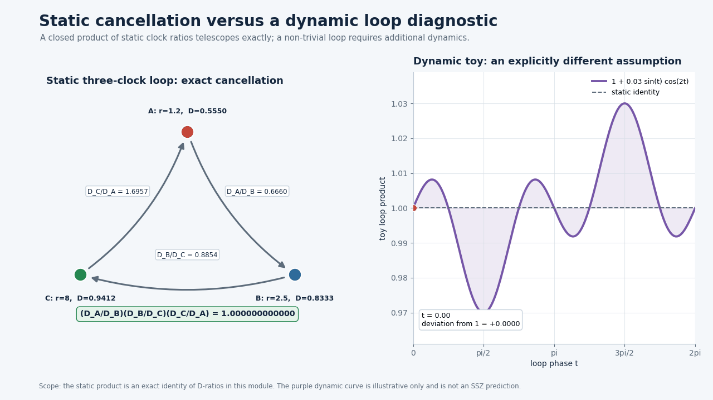

[Static PNG](outputs/holonomy_loop.png)

### Method Assignment Flow

Prime Directive observable routing and method assignment.

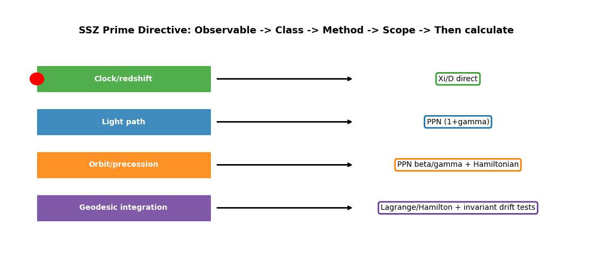

[Static PNG](outputs/method_assignment_flow.png)

### Phi Ladder State

Full phi-ladder state vector details.

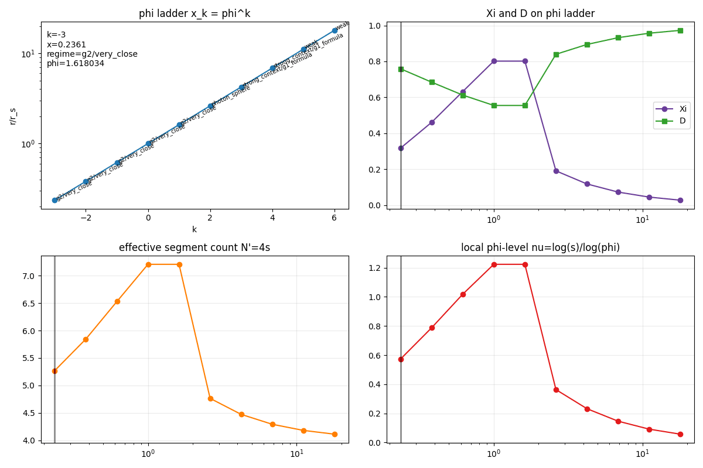

[Static PNG](outputs/phi_ladder_state.png)

### SSZ Doc Audit

Full SSZ documentation audit: section counts, keyword hotspots and bridge targets.

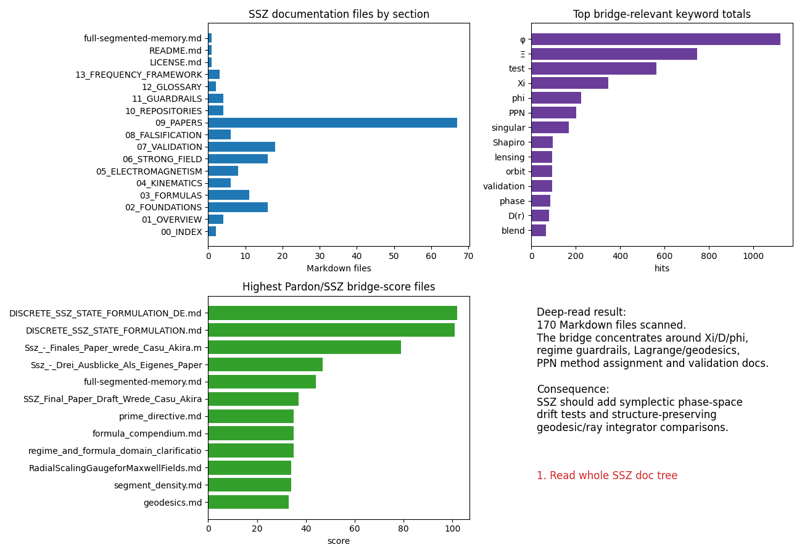

[Static PNG](outputs/ssz_doc_audit.png)
